# ✏️ Handwritten Note

**Turn any concept into something you'd actually want to read.**

You know the topic. You could write three paragraphs about it. Nobody's going to read three paragraphs. This is a [Claude Code](https://claude.com/claude-code) skill that instead turns your topic into a single, self-contained page that looks like a smart friend sketched it out on a napkin — except the napkin has a real design system, works in dark mode, and doesn't run out of room halfway through.

Ask for an explainer. Get back something you'd screenshot and send to a group chat.

---

## What it actually does

Every time you invoke it, the skill makes two decisions before writing a line of code:

1. **What shape is this content?** A process, a cycle, a comparison, a timeline, a hub of related ideas, a stack of layers — it reads your topic and picks the layout that makes a reader's life easiest, not the one that looks the coolest.
2. **What should this look like?** It asks you — brand is a matter of taste, not something worth guessing at.

Then it writes a complete, responsive, light/dark-theme-aware HTML page and publishes it as an Artifact you can look at immediately.

## See it in action

| Topic | Layout | Brand |
|---|---|---|
| [How a Vector Database Finds Things](examples/vector-db-field-notes/note.html) | Flow / Steps | Field Notes |
| [How a Vector Database Finds Things](examples/vector-db-bmc-helix/note.html) | Flow / Steps | BMC Helix |
| [The Building Blocks of an AI Agent](examples/ai-agent-building-blocks-chalkboard/note.html) | Hub & Spoke | Chalkboard |
| [The Sun's 11-Year Cycle](examples/solar-cycle-midnight-notebook/note.html) | Cycle / Loop | Midnight Notebook |
| [Black Holes, at Three Zoom Levels](examples/black-holes-zoom-field-notes/note.html) | Zoom Levels | Field Notes |
| [The BCG Growth-Share Matrix](examples/bcg-matrix-ink-marker/note.html) | Matrix / Quadrant | Ink & Marker |
| [Which Memory Should Your AI Agent Use?](examples/agent-memory-decision-tree-bmc-helix/note.html) | Decision Tree | BMC Helix |
| [Nuclear Fission vs. Fusion](examples/fission-vs-fusion-blueprint/note.html) | Comparison | Blueprint |
| [Detecting Gravitational Waves](examples/gravitational-waves-timeline-pastel-lab/note.html) | Timeline | Pastel Lab |
| [The OSI Model, Layer by Layer](examples/osi-model-sunset-deck/note.html) | Layered / Stack | Sunset Deck |
| [A Field Guide to AI Agent Jargon](examples/ai-agent-jargon-field-guide-neon-arcade/note.html) | Glossary / Field Guide | Neon Arcade |

<table>
<tr>
<td width="50%">

**Flow — Field Notes**

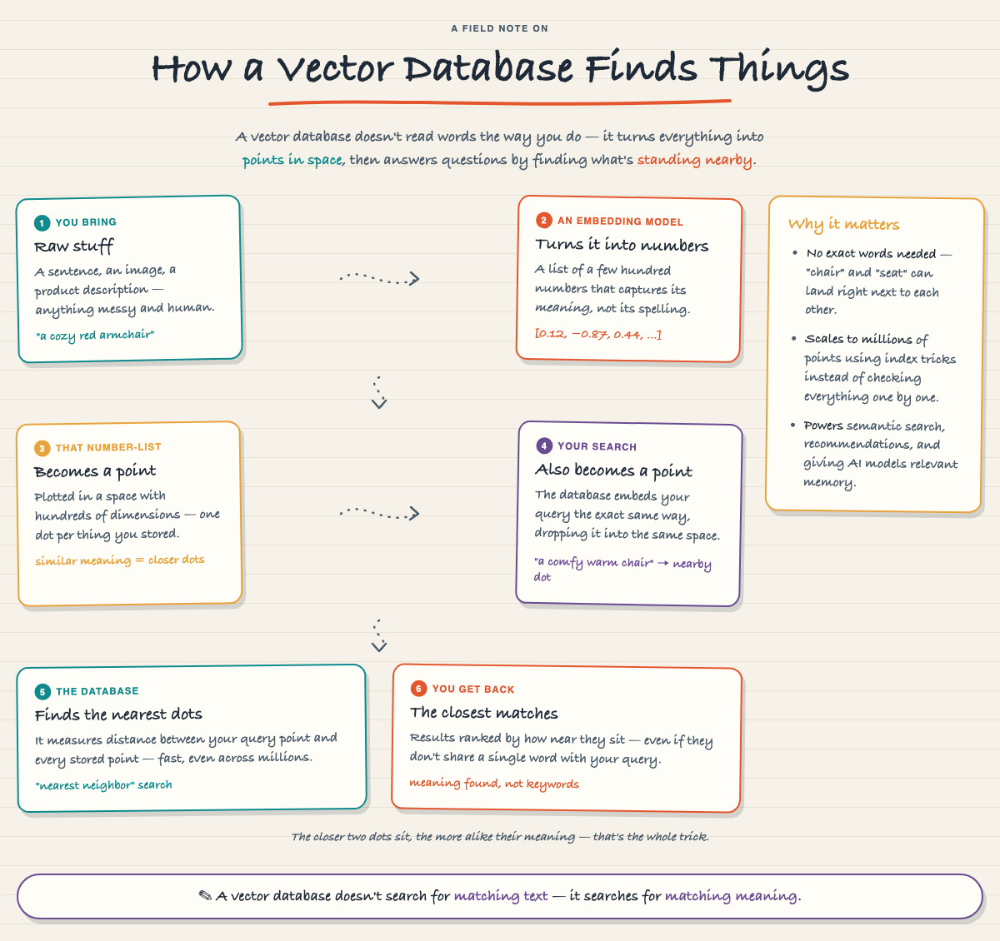

</td>
<td width="50%">

**Flow — BMC Helix**

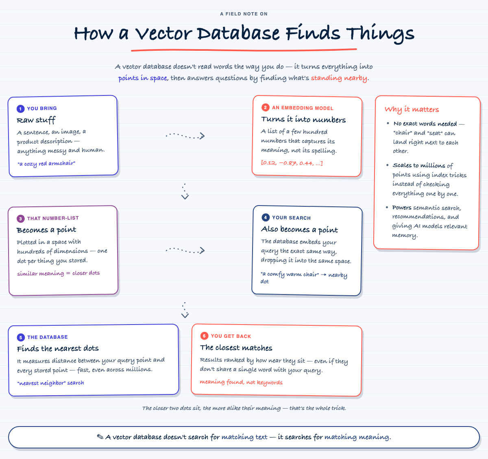

</td>
</tr>
<tr>
<td width="50%">

**Hub & Spoke — Chalkboard**

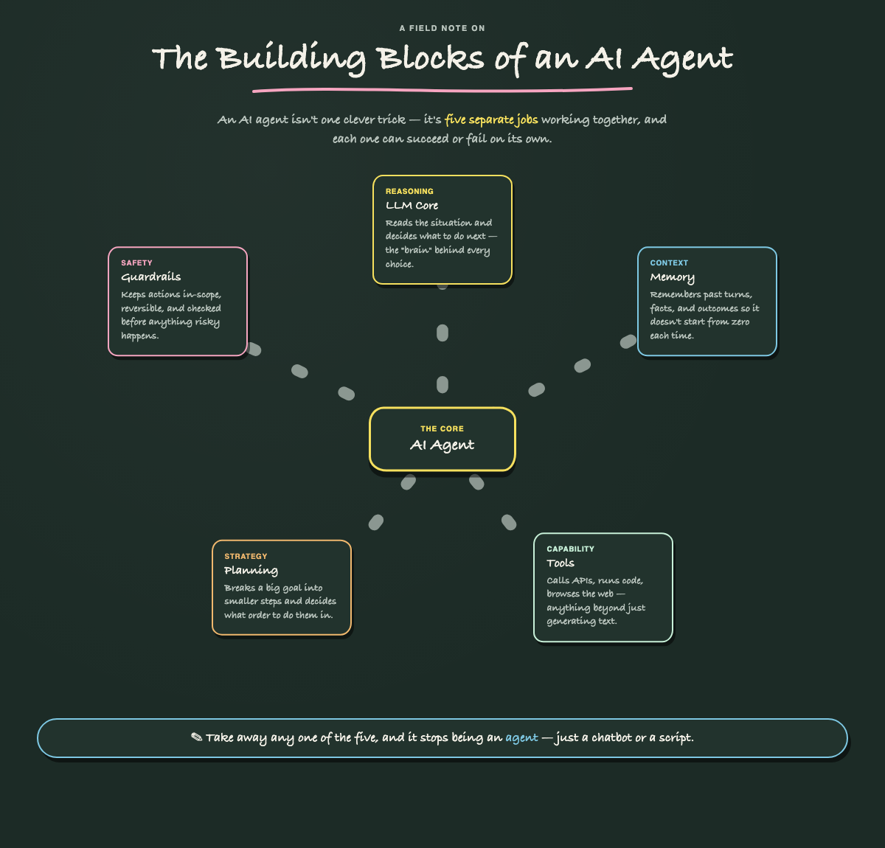

</td>
<td width="50%">

**Cycle — Midnight Notebook**

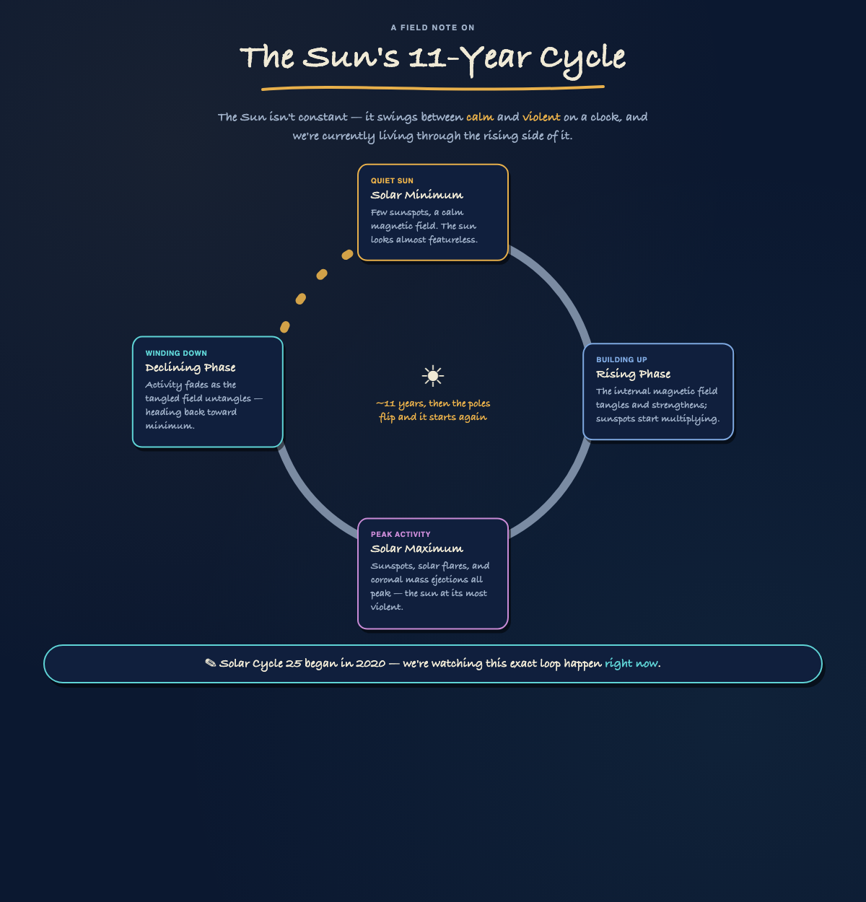

</td>
</tr>
<tr>
<td width="50%">

**Zoom Levels — Field Notes**

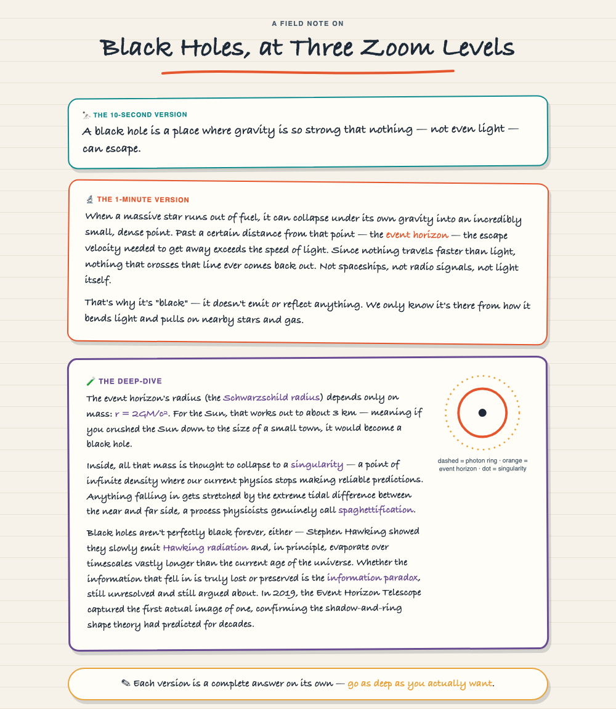

</td>
<td width="50%">

**Matrix / Quadrant — Ink & Marker**

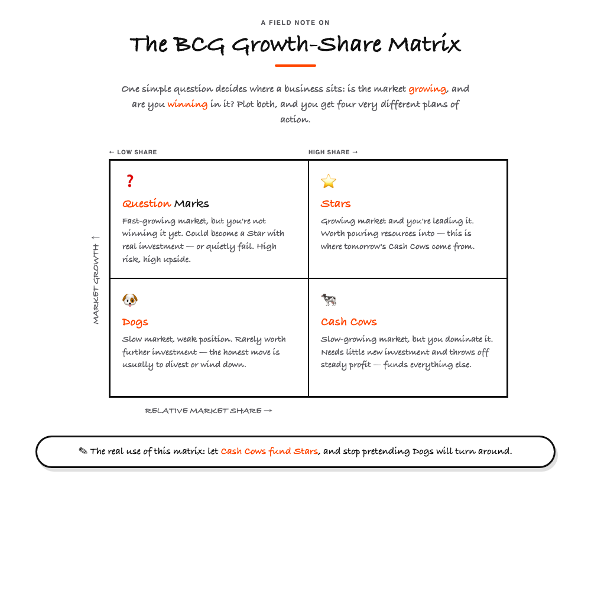

</td>
</tr>
<tr>
<td width="50%">

**Decision Tree — BMC Helix**

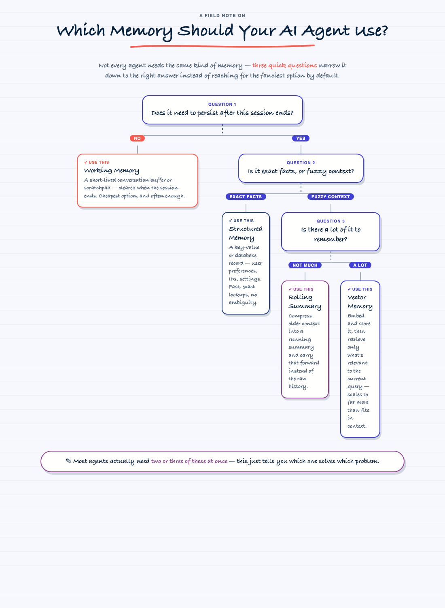

</td>
<td width="50%">

**Comparison — Blueprint**

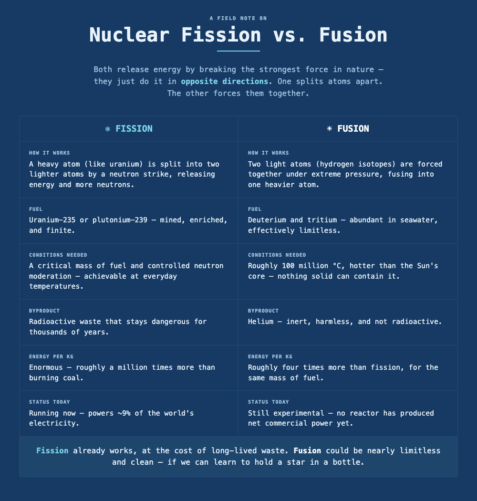

</td>
</tr>
<tr>
<td width="50%">

**Timeline — Pastel Lab**

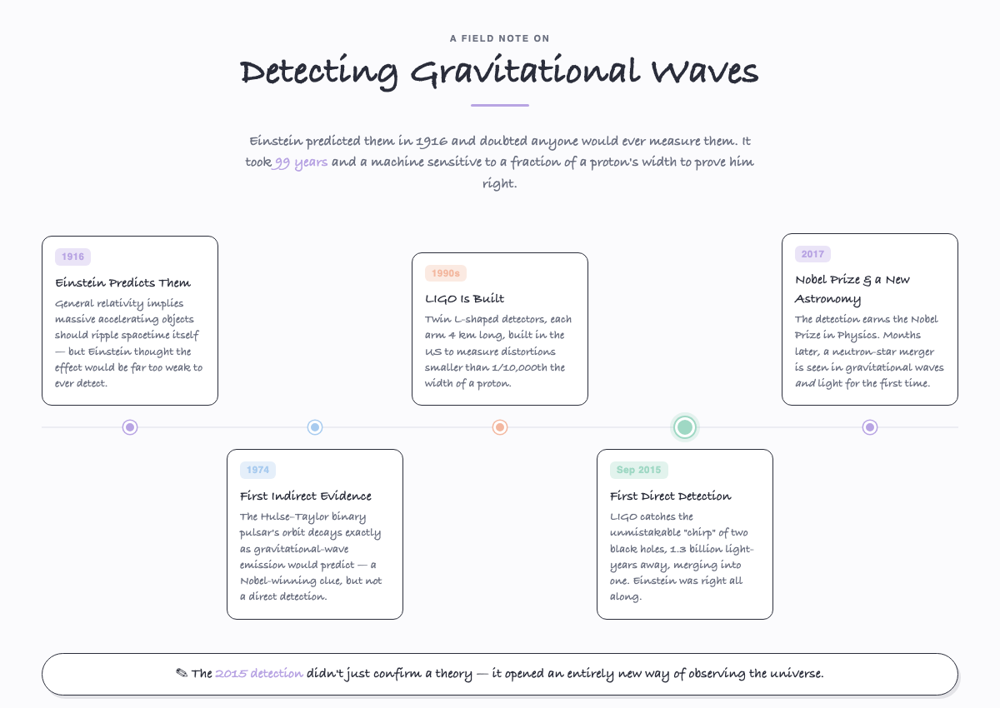

</td>
<td width="50%">

**Layered / Stack — Sunset Deck**

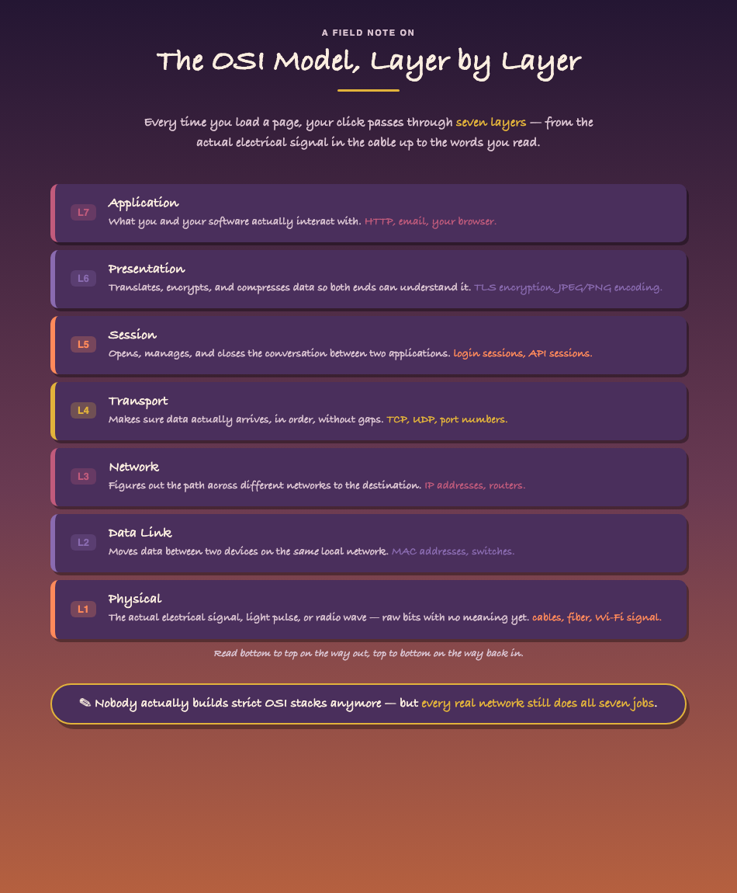

</td>
</tr>
<tr>
<td width="50%">

**Glossary / Field Guide — Neon Arcade**

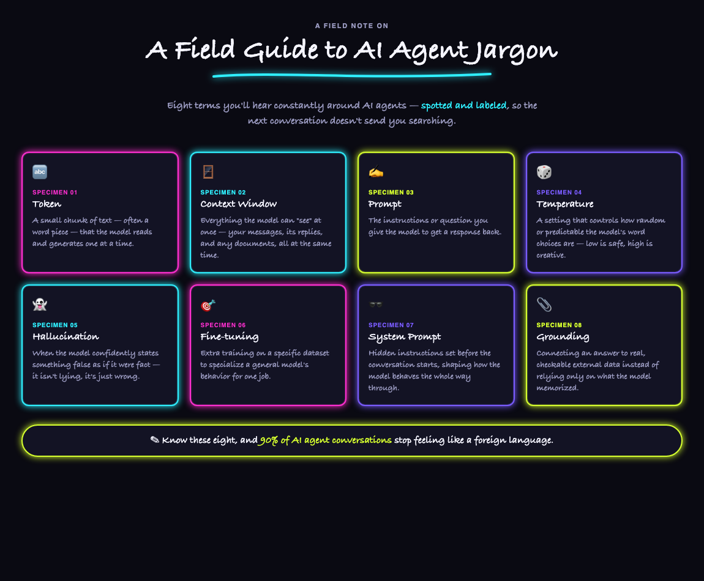

</td>
<td width="50%"></td>
</tr>
</table>

Same skill, same rigor, wildly different vibes. That's the point.

**Want to see all 13 brands side by side?** Check out the [palette catalog](examples/palette-catalog-lightning/index.html) — the same "How Lightning Works" note, rendered once per brand, in a browsable gallery with a live preview pane.

## The layouts

Picked automatically, based on what your content actually is — not habit:

| Your content is... | You get... |
|---|---|
| A happens, then B, then C | 🔀 **Flow / Steps** |
| A process that repeats forever | 🔁 **Cycle / Loop** |
| One idea, several independent facets | 🕸️ **Hub & Spoke** |
| Two things, contrasted directly | ⚖️ **Comparison** |
| Events in order, across time | 📅 **Timeline** |
| Things built on top of each other | 🧱 **Layered / Stack** |
| A topic worth explaining at multiple depths | 🔭 **Zoom Levels** |
| Two factors combine into four named buckets | 🎯 **Matrix / Quadrant** |
| The right answer depends on the reader's situation | 🌳 **Decision Tree** |
| A set of independent terms that need defining | 🔍 **Glossary / Field Guide** |

## The brands

Picked by *you*, every time:

- **Field Notes** — warm cream paper, handwritten scrawl, journal energy
- **Chalkboard** — dark board, chalk dust, "welcome to lecture" energy
- **Sticky Wall** — real sticky-note colors, sprint-retro energy
- **Ink & Marker** — stark white, one loud color, whiteboard-pitch energy
- **Midnight Notebook** — deep navy, gold ink, "this cost money" energy
- **BMC Helix** — the actual BMC Helix brand palette, hand-drawn anyway
- **Terracotta Studio** — plaster white, terracotta & sage, ceramics-workshop energy
- **Botanical Press** — soft sage paper, dusty rose & mustard, field-guide energy
- **Neon Arcade** — near-black, glowing magenta/cyan/lime, retro-cabinet energy
- **Newsprint** — off-white newsprint, one masthead red, "breaking news" energy
- **Pastel Lab** — clean white, soft pastels, science-poster energy
- **Blueprint** — deep blueprint blue, precise cyan linework, engineering-grade energy
- **Sunset Deck** — dusk-to-orange gradient, gold ink, pitch-deck-cover energy

Thirteen brands now — that's more than fits in a typical multiple-choice prompt, so Claude will usually show you a handful of well-differentiated options and let you name any of the rest directly. Full color tokens for each live in [`skill/references/brands.md`](skill/references/brands.md).

## Using it in Claude Code

**1. Get the skill onto your machine.**

```bash
git clone https://github.com/amrsingh29/handwritten-note-skill.git
ln -s "$(pwd)/handwritten-note-skill/skill" ~/.claude/skills/handwritten-note
```

That symlink means `git pull` here keeps your live skill current — no reinstalling.

**2. Start a new Claude Code session** (skills are picked up at session start).

**3. Just ask.** No slash command required — say things like:

> "Explain how OAuth works, simply"
> "Make a one-pager for how CRISPR works"
> "Can you sketch out the CAP theorem for me?"
> "Explain this in BMC Helix style" *(names the brand up front — skips the question)*

Claude will pick a layout, ask which brand you want (unless you already named one), build the page, sanity-check it, and hand you a live Artifact.

**4. Want it saved for later?** Just ask — it'll drop a `note.html` + a `preview.png` screenshot into `examples/<topic>-<brand>/` in this repo, ready to commit.

## Repo layout

```
handwritten-note-skill/
├── README.md                 you are here
├── skill/
│   ├── SKILL.md               the workflow Claude follows, step by step
│   └── references/
│       ├── layouts.md         ten layout skeletons + when to use each
│       └── brands.md          thirteen color systems, tokens and all
└── examples/                  every note that's actually been built and approved
    └── <topic>-<brand>/
        ├── note.html
        └── preview.png
```

## Adding a new brand or layout

Both reference files are living documents. Ask Claude for something new ("make a brand that looks like a ransom note") and it'll add it to the right file in the same shape as the existing entries — so your next note in that style stays consistent with this one, instead of getting reinvented from scratch.

---

*Built one topic at a time. If a note in here taught you something in ten seconds flat, it did its job.*
